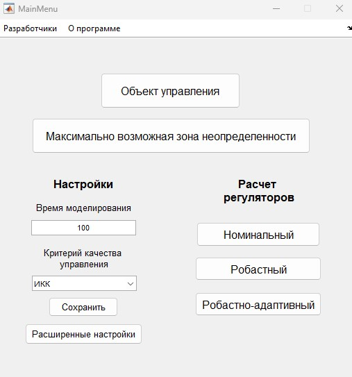

<h3 align="center">
    <p>⚙️🤖 RobAdMaster</p>
</h3>

<h4 align="center">
    <p>
        <b>English</b> | 
        <a href="lng_ru/README_ru.md">Русский</a> |
    <p>
</h4>

⚙️🤖 RobAdMaster is an application for MATLAB&Simulink for performing tasks on the synthesis of robust and robust-adaptive controllers for SiSo and MiMo systems.

This application can be used:
- For automation of industry of any branch (in which typical control laws are used)
- For systems with dimensions 1x1, 2x2 and 3x3

The RobAdMaster application also allows you to calculate the settings for the center of the uncertainty zone (nominal), calculate the limiting uncertainty zone within which a stable controller is guaranteed to be found, if the zone is smaller than necessary, this application also allows you to use another method to find the settings. The results of the work are displayed both in the graphical interface itself and in the MATLAB command line, and the result is also saved in a special .xlsx file. Among other things, there is the opportunity to look at transient processes.

## Screenshots

📷 Main menu 

<p align="center">
  
</p>

`For now the interface is only in Russian`

## Requirements

Minimum:
- Any version of MATLAB&Simulink

Recommended:
- MATLAB R2018b+

## Installation

You need to download the functions and models of this application (src folder). Then run MATLAB and specify the path to the downloaded folder. Then, to run the application, write in the command line
- Main

## Main functions
- Graphical interface for working with models
- Launch and control of Simulink models
- Setting up model parameters in real time
- Data visualization

📖 Details: [Documentation](docs)

## Updates

📅 Latest version: v0.7.0 (02.04.2025)

What's new in v0.7.0?

- Optimized approximation of control objects
- Added the ability to calculate controller parameters for an op-amp with a dimension of 3x3

📜 Change history: [CHANGELOG.md](CHANGELOG.md)

## Development and contribution

Want to contribute?

📩 Contacts: stepanovpash@mail.ru

## License

This project is distributed under a license. For more details, see [LICENSE](LICENSE.md).

## Citation

You can use any [article from the list](https://elibrary.ru/author_items.asp?authorid=1195614) for citation, for example:

```bibtex
@article{
    title = "Робастная настройка типовых регуляторов методом максимальной чувствительности",
    author = "Яковис Л.М, Степанов П.С., Стронгин П.Я.",
    booktitle = "Автоматизация в промышлености",
    number = "12",
    year = "2022",
    publisher = "Издательский дом "ИнфоАвтоматизация", Университет новых информационных технологий управления",
    url = "https://www.elibrary.ru/item.asp?id=49987609",
    pages = "47--54"
}
```